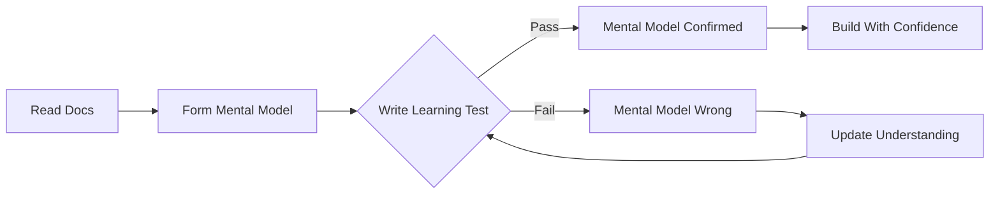
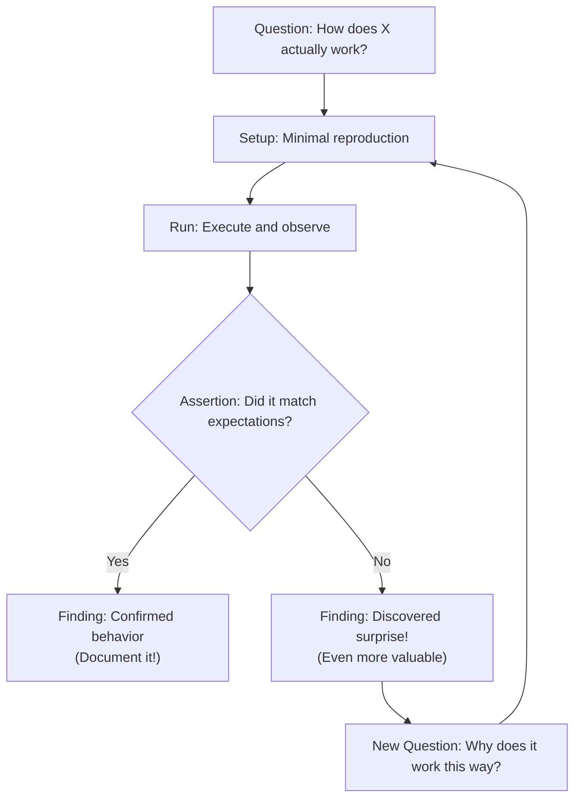
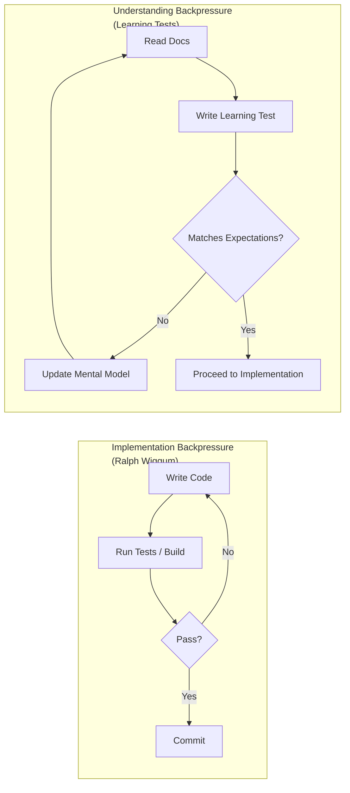
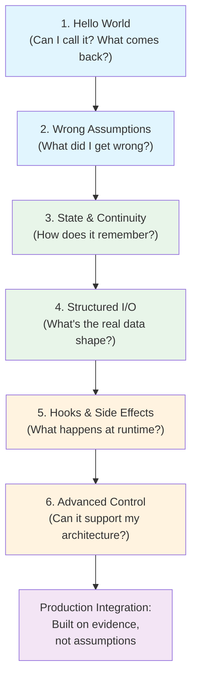

# Agentic Backpressure Deep Dive: Learning Tests & Proof-Driven Development

## The Setup

We've spent a lot of time on this show talking about research as the first step of an agentic workflow. Grep the codebase, read the docs, build a plan, then implement. That works. But there's a gap between "I read the docs" and "I actually understand how this thing behaves." Research gives you *descriptions*. What you actually need is *evidence*.

Today we're going to talk about **learning tests**---small, focused test cases that prove your understanding of an external system before you commit to building on top of it. They're cheap to write, fast to run, and they stick around as your living contract with the outside world. This is a form of **agentic backpressure**: instead of letting the agent sprint ahead on assumptions, you force it to slow down and verify.

This works for any external system: a new SDK, a database driver, a payment API, a message queue, an auth provider. Anything where the docs say one thing and the runtime might do another. We'll use the Claude Agent SDK for concrete examples, but the technique is universal.

If you remember Ralph Wiggum---short loops, fast feedback, exit and restart---this is that same idea applied earlier in the pipeline. Before you write the implementation, write a tiny program that proves the API actually works the way you think it does.

## Why Research Alone Isn't Enough

Research is great for orienting. You read the README, you grep for usage patterns, you find the type signatures. But research has a failure mode: **the agent reads the docs, builds a confident mental model, and that model is wrong.**

This happens constantly with:
- APIs that changed between versions (the blog post says `v2`, the package ships `v3`)
- Undocumented behaviors (what happens when you pass `null`? What's the default timeout?)
- Subtle interactions between options (two flags that seem independent but conflict)
- Async patterns that look straightforward in docs but have non-obvious timing or ordering
- Return types that don't match the TypeScript definitions

And this isn't just a human problem. It's an *agent* problem. LLMs are confidently wrong about APIs all the time---they hallucinate method signatures, invent options that don't exist, and mix up behaviors across library versions. The more obscure the API, the worse it gets.

The fix is simple: **write a test that runs the code and asserts what actually happens.** If your assertion fails, you learned something the docs didn't tell you. If it passes, you have a concrete foundation to build on.



## What Is a Learning Test?

A learning test isn't a unit test for *your* code. It's a test for *your understanding* of someone else's code. You're not testing that Stripe charges correctly---you're testing that you know how to call `stripe.charges.create()` and what comes back. You're not testing that Redis pub/sub works---you're testing that you understand the subscription lifecycle and message ordering guarantees.

The concept comes from the software craftsmanship world (Michael Feathers talks about them in *Working Effectively with Legacy Code*), but they're especially powerful in the age of coding agents. An agent that writes a learning test and runs it gets *ground truth* about an API. An agent that reads docs and proceeds gets *vibes*.

### The Anatomy of a Learning Test

A good learning test has four parts:

1. **A question** --- something specific you don't know for sure
2. **Minimal setup** --- the least code possible to get an answer
3. **An assertion** --- what you expect to happen
4. **A finding** --- what you actually learned (documented at the top of the file)



The finding is the whole point. It's what you carry forward into implementation. It's what you put in your CLAUDE.md or your team wiki so the next person (or agent) doesn't repeat your mistakes.

Here's the pattern we use:

```typescript
/**
 * Learning Test: [External System / API / Behavior]
 *
 * Key findings:
 * - [Concrete finding 1]
 * - [Concrete finding 2]
 * - [Surprise or gotcha that contradicts docs]
 */
```

These header comments are institutional knowledge. When your agent encounters this API six months from now in a different context window, those findings are the fastest path to correct behavior.

### Learning Tests Are Not Throwaway

There's an important distinction here. Learning tests aren't unit tests---you don't run them in CI on every commit. But they're not throwaway either. You keep them around because **they define your contract with the external system.**

When the upstream library ships a new version, you don't read the changelog and hope for the best. You re-run your learning tests. The ones that still pass? Your contract is intact. The ones that fail? That's exactly where the breaking change lives. You now have:

1. **A precise diff of what changed** --- not "something in the auth module," but "session.isValid() now checks expiration, not just signature"
2. **A reproduction case** --- if the change seems like a bug, you can hand the failing test to the maintainer as-is
3. **A guide for your code changes** --- you know exactly which assumptions in your codebase are now wrong

This makes version upgrades dramatically less scary. Instead of bumping the version, running your full test suite, and trying to figure out why 14 tests failed, you run the learning tests first and know exactly what moved underneath you.

Think of them as living documentation that can verify itself. They sit in a `learning/` or `proofs/` directory, they run in seconds, and they answer the question: "does the external world still work the way I think it does?"

## The Progression: Simple to Complex

We'll walk through six learning tests, building from "does this thing even work" to "I can build a production workflow on top of it." We're using the Claude Agent SDK as the concrete example, but swap in any external system and the structure is the same.

---

### Code Sample 1: "Hello World" --- Does This Thing Even Work?

**Title:** The Minimum Viable Learning Test

**Description:** The simplest possible interaction with the external system. For any API, this is: call one endpoint, print what comes back, assert on the shape. No business logic, no configuration, no error handling. Just: "Can I call this thing, and what does the response look like?"

For the Claude SDK, this means: call `query()` with a trivial prompt, no tools, one turn. Iterate the async event stream. Log every event type. You'll discover that the stream emits `system:init` (with a session ID), then `assistant` (the model's response), then `result:success` (the final output). That sequence is your Rosetta Stone for everything that follows.

The equivalent for other systems:
- **Stripe:** Create a test charge. What fields come back on the charge object? Is `status` a string or an enum?
- **Redis:** Set a key, get a key. Does `GET` return `string | null` or `string | undefined`?
- **S3:** Put an object, get an object. What happens to the Content-Type?

The point isn't to build anything. The point is to get your first passing test and know the shape of the world.

---

### When to Write Learning Tests (and When Not To)

Not every integration needs a learning test. If you've used `fetch()` a thousand times, you don't need to prove it works. The rule of thumb:

**Write a learning test when:**
- You're using a library or API for the first time
- The docs are sparse, auto-generated, or out of date
- You're using a feature you haven't tried before (even in a familiar library)
- The agent is hallucinating method signatures or options
- Two options might interact in non-obvious ways
- You're about to build a critical path on top of this behavior

**Skip it when:**
- The API is trivially simple and well-known
- You have working examples in your own codebase already
- The cost of being wrong is low (easy to fix later)

---

### Code Sample 2: "That's Not What I Expected" --- Catching Wrong Assumptions

**Title:** Testing Assumptions That Turn Out to Be Wrong

**Description:** This is where learning tests really earn their keep. Write a test based on what you *think* the API does, and discover it does something different. In the Claude SDK, there's an option called `allowedTools` that looks like a whitelist---you'd naturally assume passing `['Read', 'Glob', 'Grep']` means only those tools are available. Write a test. Check what tools actually show up. Discover that **`allowedTools` is silently ignored.** You need `disallowedTools` to actually restrict tools.

This pattern generalizes everywhere:
- **Auth libraries:** You assume `session.isValid()` checks expiration. It actually only checks the signature.
- **ORMs:** You assume `.save()` is an upsert. It actually throws on duplicate keys.
- **Queue systems:** You assume `ack()` removes the message. It actually just makes it invisible for a timeout.

The test that fails is more valuable than the test that passes. A failing test means you caught a wrong assumption *before* you built on top of it.

```mermaid
flowchart TD
    subgraph "Without Learning Tests"
        A1[Read API docs] --> A2[Assume Option X = whitelist]
        A2 --> A3[Build feature on that assumption]
        A3 --> A4[Feature breaks in production]
        A4 --> A5[Debug for hours]
        A5 --> A6["Discover Option X is ignored"]
    end

    subgraph "With Learning Tests"
        B1[Read API docs] --> B2[Write test for Option X]
        B2 --> B3[Test fails: not a whitelist]
        B3 --> B4[Find the real mechanism]
        B4 --> B5[Build correctly from the start]
    end
```



---

### Code Sample 3: State and Continuity --- How Does This System Remember?

**Title:** Proving State Management Semantics

**Description:** Most external systems have some notion of state: sessions, connections, transactions, cursors. The docs describe them, but the edge cases live in the runtime. For the Claude SDK, there are three ways to continue a conversation: `resume` (same session, appends to context), `forkSession` (new session, copies context), and `continue: true` (finds the most recent session by directory). Store a secret value in round 1, retrieve it in round 2 using each method. Assert on whether the session ID changes, whether the value is preserved, and whether the directory matters.

This pattern applies broadly:
- **Database transactions:** Does a rolled-back transaction release locks immediately or after a timeout?
- **WebSocket connections:** If you reconnect, does the server remember your subscriptions?
- **OAuth flows:** If you refresh a token, is the old one immediately invalid?

The goal is to build a precise mental model of the state lifecycle, backed by assertions, not assumptions.

---

### Backpressure Through Feedback Loops

Here's where learning tests connect back to the broader agentic backpressure story. In the Ralph Wiggum episode, we talked about tests, types, and builds as governors---feedback loops that keep the agent honest during implementation. Learning tests are the same concept applied to *understanding* rather than *code*.



Both loops exist to prevent the agent from building on wrong assumptions. The implementation loop catches code bugs. The understanding loop catches *conceptual* bugs---which are much more expensive to fix later because they're baked into the architecture.

In the 12-factor episode, we talked about using structured outputs as phase transitions. Learning tests are the natural gate for the *first* phase: you don't move from research to planning until your learning tests confirm your understanding of the external system.

---

### Code Sample 4: Structured Interactions --- Typed Input and Output

**Title:** Proving the Shape of Data In and Out

**Description:** Most APIs accept structured input and return structured output. Learning tests should verify the actual schema, not just what the types say. For the Claude SDK, use Zod to define an output schema, convert it to JSON Schema, pass it via `outputFormat`, and verify that the result event contains a `structured_output` field that parses correctly. Then chain it: structured output in turn 1, plaintext in turn 2, verify the model retains the structured data across turns.

More broadly:
- **GraphQL APIs:** Does the response actually match the schema, or does the server return extra fields? What happens with nullable fields?
- **gRPC services:** What does the default value look like for an unset field? Is it `0` or `undefined`?
- **Webhook payloads:** What's the actual shape of the event body? Does it match the docs, or are there undocumented fields?

Type definitions tell you what the system *should* return. Learning tests tell you what it *actually* returns.

---

### Code Sample 5: Lifecycle Hooks and Side Effects --- What Really Happens at Runtime?

**Title:** Testing Behavioral Injection and Side Effects

**Description:** Many systems have hook or middleware patterns that let you inject behavior at specific lifecycle points. Learning tests should verify: when do hooks fire, what data do they receive, and what happens to the data you return? For the Claude SDK, set up a PostToolUse hook on the Write tool, have the agent write a file, and verify your hook receives the `tool_input` (with `file_path`) and `tool_response`. Then return a `systemMessage` from the hook and discover that it's injected into the model's context but is NOT emitted as a separate event in the query stream. That's the kind of finding you'd never get from docs.

The general pattern:
- **Express middleware:** Does `next()` run synchronously or on the next tick? What happens if you call it twice?
- **Database triggers:** Does a trigger fire inside or outside the transaction? Can it see uncommitted rows?
- **Event emitters:** Are listeners called synchronously in order, or is there batching?

Side effects and lifecycle timing are the hardest things to get right from docs alone. Learning tests make them concrete.

---

### Code Sample 6: Advanced Control Flow --- Pushing the Boundaries

**Title:** Testing Non-Obvious Control Patterns

**Description:** The most valuable learning tests explore the edges of the API---patterns that are possible but not well-documented. For the Claude SDK, instead of passing a string prompt, pass an `AsyncIterable<SDKUserMessage>` that yields messages over time. The generator controls when messages arrive and when the session ends (by returning). Test that multiple yields produce multiple result events, and that ending the generator cleanly stops the session. This is the foundation for event-driven agent architectures.

More broadly, these are the tests for:
- **Streaming APIs:** What happens if you close the stream mid-chunk? Does the server get notified?
- **Cursor-based pagination:** What happens if you mutate data between cursor pages?
- **Long-polling:** What's the actual timeout behavior? Does the server close the connection or does the client?

These tests are where you discover whether the system can actually support the architecture you're planning, before you invest in building it.

---

### The Full Picture

When you put these together, you get a curriculum that builds from "does this API exist" all the way up to "can I build a production workflow on top of it." Each test answers a specific question, and the findings accumulate into a concrete understanding you can trust.



Blue: foundational understanding (does it work, what did I get wrong). Green: data and state semantics (how does it remember, what's the real shape). Orange: runtime behavior (hooks, side effects, control flow). Purple: what you actually ship---built on proof, not vibes.

---

## Using Learning Tests in Agentic Workflows

The power move is making learning tests part of your agent's workflow, not just yours. When you're building a multi-phase agentic pipeline:

**Phase 0: Learning Tests** --- Before research, before planning, before implementation. Have the agent write and run learning tests for each external system it will integrate with. The findings from these tests become part of the context for all subsequent phases.

**Phase 1: Research** --- Now the agent greps the codebase and reads docs, but it does so with verified knowledge about what the external systems actually do.

**Phase 2: Planning** --- The plan is grounded in evidence, not assumptions. The agent knows which API options actually work and which are dead letters.

**Phase 3: Implementation** --- The agent builds on top of concrete findings. When it writes the integration code, it can reference the learning tests as proof of correct behavior.

This is "specs before code" from the Ralph Wiggum episode, extended one step earlier: *proofs before specs before code.*

---

## Actions You Can Take Today

**Write a learning test before your next integration.** Pick the one API call you're least sure about. Write a test that calls it and asserts what comes back. You'll either confirm your understanding or save yourself hours of debugging.

**Document your findings.** The `Key findings:` header pattern isn't decoration. Those findings become institutional knowledge. Put them in your CLAUDE.md, your onboarding docs, your PR descriptions. When the next person (or agent) works with this API, they start from evidence, not guesswork.

**Add a learning test phase to your agent workflows.** If you're building a multi-phase agentic pipeline, add a Phase 0 that writes and runs learning tests for each external dependency. The cost is a few minutes of API calls. The payoff is an implementation built on ground truth.

## If You Remember One Thing

Research tells you what the docs say. Learning tests tell you what the code does. The gap between those two is where bugs live---and it's where agents hallucinate. Close the gap before you build on top of it.
