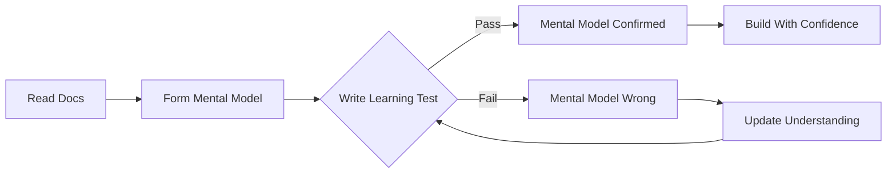
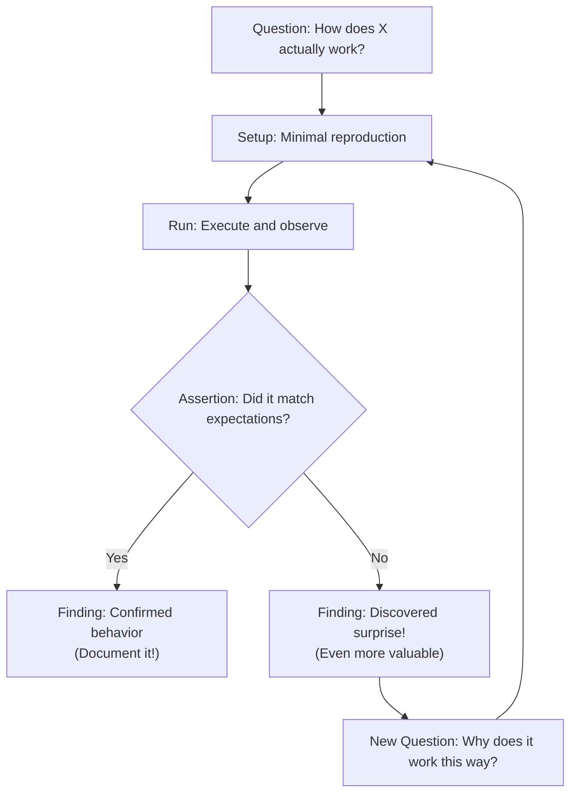
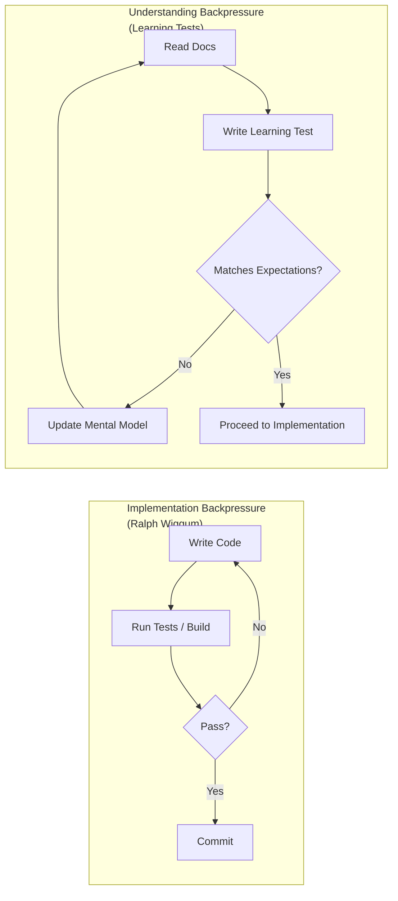

# Agentic Backpressure Deep Dive: Learning Tests & Proof-Driven Development

## The Setup

We've spent a lot of time on this show talking about research as the first step of an agentic workflow. Grep the codebase, read the docs, build a plan, then implement. That works. But there's a gap between "I read the docs" and "I actually understand how this thing behaves." Research gives you *descriptions*. What you actually need is *evidence*.

Today we're going to talk about **learning tests**---small, focused test cases that prove your understanding of an external system before you commit to building on top of it. They're cheap to write, fast to run, and they stick around as your living contract with the outside world. This is a form of **agentic backpressure**: instead of letting the agent sprint ahead on assumptions, you force it to slow down and verify.

This works for any external system: a new SDK, a database driver, a payment API, a message queue, an auth provider. Anything where the docs say one thing and the runtime might do another. We'll use the Claude Agent SDK for concrete examples, but the technique is universal.

If you remember Ralph Wiggum---short loops, fast feedback, exit and restart---this is that same idea applied earlier in the pipeline. Before you write the implementation, write a tiny program that proves the API actually works the way you think it does.

## Why Research Alone Isn't Enough

Research is great for orienting. You read the README, you grep for usage patterns, you find the type signatures. But research has a failure mode: **the agent reads the docs, builds a confident mental model, and that model is wrong.**

This happens constantly with:
- APIs that changed between versions (the blog post says `v2`, the package ships `v3`)
- Undocumented behaviors (what happens when you pass `null`? What's the default timeout?)
- Subtle interactions between options (two flags that seem independent but conflict)
- Async patterns that look straightforward in docs but have non-obvious timing or ordering
- Return types that don't match the TypeScript definitions

And this isn't just a human problem. It's an *agent* problem. LLMs are confidently wrong about APIs all the time---they hallucinate method signatures, invent options that don't exist, and mix up behaviors across library versions. The more obscure the API, the worse it gets.

The fix is simple: **write a test that runs the code and asserts what actually happens.** If your assertion fails, you learned something the docs didn't tell you. If it passes, you have a concrete foundation to build on.



## What Is a Learning Test?

A learning test isn't a unit test for *your* code. It's a test for *your understanding* of someone else's code. You're not testing that Stripe charges correctly---you're testing that you know how to call `stripe.charges.create()` and what comes back. You're not testing that Redis pub/sub works---you're testing that you understand the subscription lifecycle and message ordering guarantees.

The concept comes from the software craftsmanship world (Michael Feathers talks about them in *Working Effectively with Legacy Code*), but they're especially powerful in the age of coding agents. An agent that writes a learning test and runs it gets *ground truth* about an API. An agent that reads docs and proceeds gets *vibes*.

### The Anatomy of a Learning Test

A good learning test has four parts:

1. **A question** --- something specific you don't know for sure
2. **Minimal setup** --- the least code possible to get an answer
3. **An assertion** --- what you expect to happen
4. **A finding** --- what you actually learned (documented at the top of the file)



The finding is the whole point. It's what you carry forward into implementation. It's what you put in your CLAUDE.md or your team wiki so the next person (or agent) doesn't repeat your mistakes.

Here's the pattern we use:

```typescript
/**
 * Learning Test: [External System / API / Behavior]
 *
 * Key findings:
 * - [Concrete finding 1]
 * - [Concrete finding 2]
 * - [Surprise or gotcha that contradicts docs]
 */
```

These header comments are institutional knowledge. When your agent encounters this API six months from now in a different context window, those findings are the fastest path to correct behavior.

### Learning Tests Are Not Throwaway

There's an important distinction here. Learning tests aren't unit tests---you don't run them in CI on every commit. But they're not throwaway either. You keep them around because **they define your contract with the external system.**

When the upstream library ships a new version, you don't read the changelog and hope for the best. You re-run your learning tests. The ones that still pass? Your contract is intact. The ones that fail? That's exactly where the breaking change lives. You now have:

1. **A precise diff of what changed** --- not "something in the auth module," but "session.isValid() now checks expiration, not just signature"
2. **A reproduction case** --- if the change seems like a bug, you can hand the failing test to the maintainer as-is
3. **A guide for your code changes** --- you know exactly which assumptions in your codebase are now wrong

This makes version upgrades dramatically less scary. Instead of bumping the version, running your full test suite, and trying to figure out why 14 tests failed, you run the learning tests first and know exactly what moved underneath you.

Think of them as living documentation that can verify itself. They sit in a `learning/` or `proofs/` directory, they run in seconds, and they answer the question: "does the external world still work the way I think it does?"

## The Live Demo

We'll walk through two learning test sequences, then pick something new and write one live.

---

### Demo 1: Hello World --- Does This Thing Even Work? (`00` → `00b` → `00c` → `01`)

The simplest possible interaction with the external system. For any API, this is: call one endpoint, print what comes back, assert on the shape. No business logic, no configuration, no error handling. Just: "Can I call this thing, and what does the response look like?"

We build up to the first real learning test in four incremental steps. Each step adds one concept.

**Step 1: Just call it (`00-sdk-basics.ts`)**

The absolute minimum. One import, one function call, `console.log` the raw output. You'll get a wall of JSON, but you'll know it works.

```typescript
import { query } from "@anthropic-ai/claude-agent-sdk";

for await (const message of query({
  prompt: "Say hello",
  options: { allowedTools: [] },
})) {
  console.log(message);
}
```

**Step 2: Filter the noise (`00b-filter-events.ts`)**

OK, raw JSON is unreadable. Let's just print event types and pull out the interesting fields.

```diff
 for await (const message of query({
   prompt: "Say hello",
-  options: { allowedTools: [] },
+  options: {
+    permissionMode: "bypassPermissions",
+    allowedTools: [],
+    maxTurns: 1,
+    model: "haiku",
+  },
 })) {
-  console.log(message);
+  const subtype = "subtype" in message ? message.subtype : undefined;
+  console.log(`[${message.type}${subtype ? `:${subtype}` : ""}]`);
+
+  if (message.type === "system" && message.subtype === "init") {
+    console.log(`  session_id: ${message.session_id}`);
+    console.log(`  tools: ${message.tools.join(", ")}`);
+  }
+
+  if (message.type === "assistant") {
+    const text = message.message.content
+      .filter((b: any) => b.type === "text")
+      .map((b: any) => b.text)
+      .join("");
+    console.log(`  ${text.substring(0, 120)}`);
+  }
+
+  if (message.type === "result" && message.subtype === "success") {
+    console.log(`  result: ${message.result.substring(0, 120)}`);
+  }
 }
```

Now you can see the shape: `system:init` → `assistant` → `result:success`. That's the Rosetta Stone.

**Step 3: Collect and check (`00c-collect-and-check.ts`)**

Instead of just printing, accumulate data and verify it at the end. This is the bridge to a real test---we're making assertions, just not with a test framework yet.

```diff
+const events: Array<{ type: string; subtype?: string }> = [];
+let sessionId: string | undefined;
+let availableTools: string[] = [];
+let finalResult = "";
+
 for await (const message of query({ ... })) {
   const subtype = "subtype" in message ? (message.subtype as string) : undefined;
-  console.log(`[${message.type}${subtype ? `:${subtype}` : ""}]`);
+  events.push({ type: message.type, subtype });

   if (message.type === "system" && message.subtype === "init") {
-    console.log(`  session_id: ${message.session_id}`);
-    console.log(`  tools: ${message.tools.join(", ")}`);
+    sessionId = message.session_id;
+    availableTools = message.tools;
   }
-  // ... (remove inline printing)
+
+  if (message.type === "result" && message.subtype === "success") {
+    finalResult = message.result;
+  }
 }
+
+// Manual checks -- these become assertions in 01
+console.log(`first event is system:init? ${events[0]?.type === "system"}`);
+console.log(`has assistant event? ${events.some((e) => e.type === "assistant")}`);
+console.log(`last event is result:success? ${events.at(-1)?.type === "result"}`);
+console.log(`got a session_id? ${sessionId !== undefined}`);
+console.log(`got a result? ${finalResult.length > 0}`);
```

**Step 4: Real test (`01-hello-world.test.ts`)**

Now swap the manual checks for real assertions. Add `bun:test`, a temp directory, and `expect()`. The logic is identical---we just wrapped it in a test harness.

```diff
+import { describe, expect, test, beforeAll, afterAll } from "bun:test";
+import { mkdtemp, rm } from "node:fs/promises";
+
+describe("01: Hello World", () => {
+  let tempDir: string;
+  beforeAll(async () => { tempDir = await mkdtemp(...); });
+  afterAll(async () => { await rm(tempDir, { recursive: true }); });
+
+  test("what events does query() emit?", async () => {
     const events = [];
     let sessionId, finalResult;

     for await (const message of query({ ... })) {
       // ... same collection logic ...
     }

-    console.log(`first event is system:init? ${events[0]?.type === "system"}`);
-    console.log(`got a session_id? ${sessionId !== undefined}`);
-    console.log(`got a result? ${finalResult.length > 0}`);
+    expect(events[0]).toEqual({ type: "system", subtype: "init" });
+    expect(sessionId).toBeDefined();
+    expect(events.at(-1)).toEqual({ type: "result", subtype: "success" });
+    expect(finalResult.length).toBeGreaterThan(0);
+  });
+});
```

That's it. Four files, each one a small step. The final test is a real learning test with documented findings, and every intermediate step is runnable on its own. For the Claude SDK, this means: call `query()` with a trivial prompt, no tools, one turn. Iterate the async event stream. The stream emits `system:init` (with a session ID), then `assistant` (the model's response), then `result:success` (the final output).

The equivalent for other systems:
- **Stripe:** Create a test charge. What fields come back on the charge object? Is `status` a string or an enum?
- **Redis:** Set a key, get a key. Does `GET` return `string | null` or `string | undefined`?
- **S3:** Put an object, get an object. What happens to the Content-Type?

The point isn't to build anything. The point is to get your first passing test and know the shape of the world.

---

### When to Write Learning Tests (and When Not To)

Not every integration needs a learning test. If you've used `fetch()` a thousand times, you don't need to prove it works. The rule of thumb:

**Write a learning test when:**
- You're using a library or API for the first time
- The docs are sparse, auto-generated, or out of date
- You're using a feature you haven't tried before (even in a familiar library)
- The agent is hallucinating method signatures or options
- Two options might interact in non-obvious ways
- You're about to build a critical path on top of this behavior

**Skip it when:**
- The API is trivially simple and well-known
- You have working examples in your own codebase already
- The cost of being wrong is low (easy to fix later)

---

### Demo 2: The Wrong Assumption Arc (`02 -> 02b -> 02c`)

This is the core of the episode. Three files that tell the story of catching a wrong assumption:

**02-wrong-assumptions.test.ts --- The Naive Test**

"I want a read-only research agent. The SDK has `allowedTools`. I'll pass `['Read', 'Glob', 'Grep']` and that should whitelist just those tools." Write the test. Run it. **Write is still available.** `allowedTools` is silently ignored. The assumption was wrong.

This is the moment. The test you wrote in 30 seconds just saved you 2 hours of debugging a multi-phase workflow where the "research-only" agent was secretly able to modify your codebase.

**02b-the-fix.test.ts --- Dig Deeper**

OK, so `allowedTools` doesn't work. We look at the SDK types, find `disallowedTools`. Write a new test. Pass `disallowedTools: ['Write', 'Edit', 'NotebookEdit', 'Bash']`. Check the init event. Write is gone. Edit is gone. Bash is gone. Read, Glob, Grep are still there. *Now* we have a read-only agent.

**02c-plan-mode.test.ts --- The Broader Picture**

While we're in here, we find `permissionMode: 'plan'` and the `canUseTool` callback. Test them both. `plan` mode is a blanket read-only switch. `canUseTool` gives per-call programmatic control. End with a summary: three valid ways to restrict an agent, and `allowedTools` is not one of them.

```mermaid
flowchart TD
    subgraph "Without Learning Tests"
        A1[Read API docs] --> A2[Assume allowedTools = whitelist]
        A2 --> A3[Build multi-phase workflow]
        A3 --> A4[Research agent writes files]
        A4 --> A5[Debug for hours]
        A5 --> A6["Discover allowedTools is ignored"]
    end

    subgraph "With Learning Tests"
        B1[Read API docs] --> B2["Write test (02)"]
        B2 --> B3["Test surprise: not a whitelist"]
        B3 --> B4["Find real mechanism (02b)"]
        B4 --> B5["Map all options (02c)"]
        B5 --> B6[Build correctly from the start]
    end
```



---

### Demo 3: HMAC Verification --- A Different Kind of API (`02-hmac-verification.test.ts`)

Same technique, completely different domain. We're testing `node:crypto`---not an SDK, just a standard library. The question: how does `timingSafeEqual` actually behave?

The naive assumption is that `timingSafeEqual(a, b)` returns `false` when signatures don't match. But what if the inputs have different lengths? It **throws**. Not `false`, a full `ERR_CRYPTO_TIMING_SAFE_EQUAL_LENGTH` exception. If you're writing webhook verification and an attacker sends a truncated signature, your naive code crashes instead of rejecting.

The learning test catches this, and the fix is simple: check lengths before calling `timingSafeEqual`. But you'd never know to do that from the docs.

---

### Demo 4: Pick Something Live

We pick an API or behavior we haven't tested yet and write a learning test from scratch on stream. No prep, no script. Just the question -> setup -> assertion -> finding loop in real time.

---

### Backpressure Through Feedback Loops

Here's where learning tests connect back to the broader agentic backpressure story. In the Ralph Wiggum episode, we talked about tests, types, and builds as governors---feedback loops that keep the agent honest during implementation. Learning tests are the same concept applied to *understanding* rather than *code*.



Both loops exist to prevent the agent from building on wrong assumptions. The implementation loop catches code bugs. The understanding loop catches *conceptual* bugs---which are much more expensive to fix later because they're baked into the architecture.

In the 12-factor episode, we talked about using structured outputs as phase transitions. Learning tests are the natural gate for the *first* phase: you don't move from research to planning until your learning tests confirm your understanding of the external system.

---

## Using Learning Tests in Agentic Workflows

The power move is making learning tests part of your agent's workflow, not just yours. When you're building a multi-phase agentic pipeline:

**Phase 0: Learning Tests** --- Before research, before planning, before implementation. Have the agent write and run learning tests for each external system it will integrate with. The findings from these tests become part of the context for all subsequent phases.

**Phase 1: Research** --- Now the agent greps the codebase and reads docs, but it does so with verified knowledge about what the external systems actually do.

**Phase 2: Planning** --- The plan is grounded in evidence, not assumptions. The agent knows which API options actually work and which are dead letters.

**Phase 3: Implementation** --- The agent builds on top of concrete findings. When it writes the integration code, it can reference the learning tests as proof of correct behavior.

This is "specs before code" from the Ralph Wiggum episode, extended one step earlier: *proofs before specs before code.*

---

## More Examples to Explore

The code samples below aren't part of the live demo, but they show how the same technique extends to more complex API behaviors. Check them out in the repo:

- **03-state-and-continuity.test.ts** --- How does the SDK handle session continuity? Tests `resume` (same session ID, preserves context), `forkSession` (new session ID, copies context), and `continue: true` (finds most recent session by directory). The same questions apply to database transactions, WebSocket reconnections, and OAuth token refresh.

- **04-structured-output.test.ts** --- How does structured output actually work? Uses Zod to define a schema, passes it via `outputFormat`, and verifies the result event contains a parsed `structured_output` object. Then chains structured and plaintext output across session turns. Applies to any API with typed responses: GraphQL, gRPC, webhook payloads.

- **05-hooks-and-side-effects.test.ts** --- When do hooks fire, what data do they get, and what happens to the data you return? Discovers that `systemMessage` returned from a hook is injected into the model's context but is NOT emitted as a separate event in the query stream. The same questions apply to Express middleware, database triggers, and event emitters.

---

## Actions You Can Take Today

**Write a learning test before your next integration.** Pick the one API call you're least sure about. Write a test that calls it and asserts what comes back. You'll either confirm your understanding or save yourself hours of debugging.

**Document your findings.** The `Key findings:` header pattern isn't decoration. Those findings become institutional knowledge. Put them in your CLAUDE.md, your onboarding docs, your PR descriptions. When the next person (or agent) works with this API, they start from evidence, not guesswork.

**Add a learning test phase to your agent workflows.** If you're building a multi-phase agentic pipeline, add a Phase 0 that writes and runs learning tests for each external dependency. The cost is a few minutes of API calls. The payoff is an implementation built on ground truth.

## If You Remember One Thing

Research tells you what the docs say. Learning tests tell you what the code does. The gap between those two is where bugs live---and it's where agents hallucinate. Close the gap before you build on top of it.
